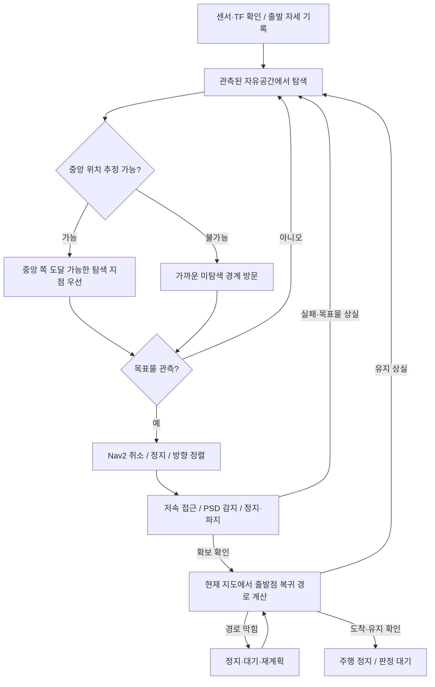

# 미션1 경로 계획

**상태:** Codex 초안 — Claude 검토·실물 검증 전  
**설계 의도:** 알려진 중앙 위치는 탐색 우선순위로만 활용하고, 실제 경로는 온라인 지도에서 생성해 확보 후 출발점으로 복귀한다.

근거: [규정](../../competition_rules.md) 2.1–2.3, 7.1, 9–14절과 [규정 대응 계획](2026-10-08-rules-response-plan.md). 장애물 배치를 모르므로 대회용 고정 경유점 목록은 만들지 않는다. 아래는 경로 선택 설계이며 실행 코드는 아니다.

## 1. 전체 흐름

## 2. 좌표와 출발점

- 탐색·복귀 목표는 SLAM의 `map` 프레임으로 관리한다. 센서·TF가 준비되고 움직이기 전에 출발 자세를 기록한다.
- 규정상 중앙은 경기장 좌표 `(1.8 m, 1.8 m)`지만 SLAM 원점은 경기장 모서리가 아니다. 경기장 벽과 3.6 m 규격으로 위치·방향을 추정한 뒤 중앙을 `map`으로 변환한다.
- 벽 정합이 불확실하면 중앙 좌표를 보내지 않고 가까운 관측 가능한 영역을 탐색한다. 장애물 면을 외벽으로 오인하지 않도록 여러 위치에서 관측을 확인한다.
- `(1,9)`와 `(9,1)`은 같은 알고리즘을 사용한다. 배정 위치·방향을 공개 후 사람이 입력하는 절차에 의존하지 않는다.
- 루프 클로저 뒤 출발점 오차는 실물 왕복으로 확인한다. 지도 재초기화·프레임 변경 시 예전 출발 좌표를 그대로 사용하지 않는다. 보정이 실제로 문제가 되면 SLAM 자세 그래프와 연결한 시작점 갱신을 추가 검토한다.

## 3. 탐색 지점 선택

고정 9×9 순회 대신 **알려진 자유공간과 미지 영역의 경계(frontier)**를 순차 방문한다. 목표물은 중앙에서 시작하지만 상대가 이동시킬 수 있으므로 중앙만 반복해서 찾지 않는다.

1. `/map`에서 자유공간에 인접한 미지 영역의 경계를 모은다. 지도 외곽·점 잡음·지나치게 작은 경계는 후보에서 제외한다.
2. 경계 자체가 아니라 경계의 **관측된 자유공간 쪽**에 안전 여유가 있는 관측 지점을 둔다. 로봇 외곽과 비용지도상 충돌 여부를 확인한다.
3. 현재 위치에서 연결된 자유공간 안에서 도달 가능한 후보만 남긴다. Nav2가 반환한 경로 전체가 미지 영역을 관통하지 않는지 확인한다.
4. 중앙 위치를 신뢰할 수 있고 중앙 탐색이 아직 끝나지 않았다면 중앙까지 남은 거리를 줄이는 후보를 우선한다. 그중 실제 경로 길이가 짧은 후보를 고른다.
5. 중앙에 가까운 후보가 모두 막혔거나 해당 영역을 이미 관측했다면 전체 후보 중 경로 길이가 가장 짧은 후보를 선택한다. 우회 때문에 일시적으로 중앙에서 멀어지는 이동도 허용한다.
6. 후보 도달 후 안전한 회전 여유가 있을 때 카메라 관측 방향을 바꿔 목표물을 찾는다. 지도 탐색 완료는 카메라 관측 완료와 다르다. 이미 알려진 중앙 주변도 카메라가 보지 못한 방향은 확인한다.
7. 실패한 후보는 같은 지도·장애물 조건에서 바로 재선택하지 않는다. 지도 변경·장애물 해소 후 재검토하고, 재시도 횟수·대기 시간은 사전 YAML로 제한한다.

중앙 좌표 자체도 비용지도에서 도달 가능하고 경로 전체가 관측된 안전공간에 있을 때만 직접 목적지로 쓴다. 도달 불가능한 중앙으로 계속 액션을 보내지 않는다.

후보 선택은 미션 제어가 담당하고 실제 A* 경로 계산·추종은 기존 Nav2가 담당한다. 새 A* 구현이나 여러 가중치의 점수 함수를 추가하지 않는다. 목표물 관측은 탐색 이동 중에도 감시한다.

## 4. 실제 경로 생성·안전 조건

| 책임 | 기존 구성 / 계획 |
|---|---|
| 지도·위치 | `cwu_slam` 온라인 SLAM, `/map`, `map → odom → base_link` |
| 전역 경로 | `cwu_nav` NavFn A*, `ComputePathToPose`로 후보 경로 확인 후 `NavigateToPose`로 이동 |
| 경로 추종 | 기존 Regulated Pure Pursuit, 실측 속도·가속·제동 한계 적용 |
| 주변 장애물 | LiDAR 비용지도와 Collision Monitor. 상대 로봇도 통행 장애물로 취급 |
| 경로 실패 | 정지 → 제한된 대기 → 재계획 → 다른 후보. 장애물을 밀거나 무조건 후진하지 않음 |
| 최종 접근 | `/target/bearing` 기반 시각 서보, PSD 정지·파지 연동 |

현재 `nav2.yaml`은 `allow_unknown: true`다. 이번 설계는 **관측된 자유공간 쪽 frontier에 도달**하므로 경기용 탐색·복귀 구성은 미지 영역 통과를 금지하는 방향으로 검증한다. `allow_unknown`을 끄는 것만으로 완결되지 않으며 목표 허용오차로 대체된 경로 끝점·전체 경로·costmap 갱신 여부까지 확인해야 한다. 미탐색 경계 탐색 자체에 미지 공간 관통이 필수인 것은 아니다.

통로 가능 여부는 `실제 외곽 폭 + 양쪽 주행 여유 < 400 mm`를 출발 조건으로 확인한다. `nav2.yaml`의 반경0.22 m는 데모 기본값이며, 실물은 `drive_config.py`가 측정 반경으로 덮어쓴다. 따라서 원본 YAML만 보고 실제 크기를 판단하지 않는다.

더 중요한 제한은 실물 Collision Monitor의 정지 영역이다. 현재 사각형 반폭은 `반경 + 제동거리 + 안전여유 + 지연 × 최대바퀴속도`다. 벽 사이에서 정지 영역이 양쪽 벽을 포함하면 경로가 있어도 이동이 막힌다. 통로·회전 시험을 선행하고, 필요하면 낮춘 속도로 제동 여유를 다시 측정한다. 안전 영역을 근거 없이 줄이지 않는다.

## 5. 목표물 발견 뒤 경로 전환

1. 최신 목표물 관측을 확인하고 Nav2 목표를 취소한다. 주행 정지 후 명령 주체를 서보로 바꾼다.
2. 카메라의 수평 오차를 줄여 세로 중심선에 맞춘다. 정렬 전 전진하지 않는다.
3. 목표물이 계속 보이고 안전 입력이 유효할 때 저속 전진한다. 카메라 방향을 임의 거리의 좌표로 바꿔 Nav2 목표를 만들지 않는다.
4. 목표물을 잃거나 장애물로 진행이 막히면 정지한다. 직진 우회·맹목 전진을 하지 않고, 안전한 관측 지점 탐색으로 돌아간다. 마지막 관측 당시 **로봇 자세와 관측 방향**은 재탐색 힌트로만 보관한다.
5. 그리퍼 PSD의 유효·최신 근접 감지가 지속되면 정지·정지 확인·닫힘·유지 확인을 수행한다. 확보 전에는 복귀를 시작하지 않는다.

LiDAR 안전 정지는 접근 중에도 적용한다. 목표물을 본 방향에 상대나 장애물이 있으면 카메라 관측만으로 통행 가능하다고 판단하지 않는다. 목표물이 근접 시 화면 밖으로 나간다면 장착 pitch부터 검증하며, 열린 루프 전진을 기본 설계로 사용하지 않는다.

## 6. 복귀 경로

- 확보 직후 현재 지도에서 출발점으로 새 경로를 계산한다. 출발 때 경로를 그대로 역순 재생하지 않는다. 상대 로봇·지도 보정·확장 그리퍼·운반 외곽을 반영한다.
- 확보 시 그리퍼와 큐브가 주행 외곽을 바꾸는지 실측한다. 최초 구성부터 탐색·운반 모두를 포함하는 보수적 외곽으로 통행 가능한지 확인한다.
- 경로가 막히면 정지·대기·재계획한다. 다른 통로가 있으면 우회하며, 없으면 안전한 관측 공간에서 경로 정보를 추가 확보한다. 경로가 없다는 이유로 장애물을 밀지 않는다.
- 유지 상실이 확인되면 정지 후 목표물 재탐색으로 돌아간다. 유지가 불명확하면 확보 성공으로 간주하지 않고 정지·재확인한다.
- 출발점 도착은 위치·정지·유지를 함께 확인한다. 그리퍼 자동 개방 필요 여부는 미션1 완료 판정 확인 후 정한다.

시간 예산은 `현재 복귀 경로 길이 / 실측 운반 유효속도 + 회전·대기·재계획 여유`로 산정한다. 평상시 최고속도를 운반 평균속도로 쓰지 않는다. 남은600초 예산에서 복귀 여유가 줄어들면 확보 후 탐색을 멈추고 운반을 우선한다. 미확보 상태의 빈손 복귀는 목표물–출발점 거리 판정에 도움이 되지 않는다.

## 7. 구현과 검증 순서

1. 실측 외곽·제동거리로 실제400 mm 통로와 회전 가능 여부를 확인한다.
2. 미션 제어에 출발 자세 기록·자유공간 frontier 선택·Nav2 액션 결과 처리를 연결한다. 튜닝값은 사전 YAML에 둔다.
3. 벽 정합으로 중앙 우선순위를 추가한다. 정합 불확실 시 가까운 frontier 탐색이 계속 동작해야 한다.
4. Nav2/서보 선택·PSD 파지·확보 복귀를 연결한다. 두 제어기가 동시에 모터 명령을 내지 않도록 한다.
5. 하드웨어 없는 지도 검사: 막힌 중앙, 중앙으로부터 멀어져야 우회 가능한 배치, 미지 영역 관통 금지, 잡음 frontier, 후보 소진·지도 변경 후 재시도.
6. ROS 통합 검사: 경로 실패, 상대의 통로 점유·해소, 목표물 발견 시 액션 취소, 입력 만료, 유지 상실, SLAM 보정 뒤 복귀. 영향 패키지 빌드·테스트를 수행한다.
7. 양 출발 위치와 서로 다른 미공개 점대칭 배치에서 설정 변경 없이600초 안에 확보·복귀를 반복한다. 시간·접촉·오검출·실패 원인을 기록한다.

**이번 검증:** 기존 Nav2 설정·실측 설정 덮어쓰기·미션 설계 연결을 확인했다. 문서만 추가했으며 새 경로 선택 코드·빌드·시뮬레이션·실물 시험은 수행하지 않았다.

**변경 파일:** 이 문서 하나.  
**열린 질문:** 실제 통로 여유와 운반 외곽, 벽 정합 신뢰도, SLAM 보정 후 출발점 오차, 유지 피드백, 운송 완료 판정 허용 범위. Claude 검토 전 초안으로 유지한다.
