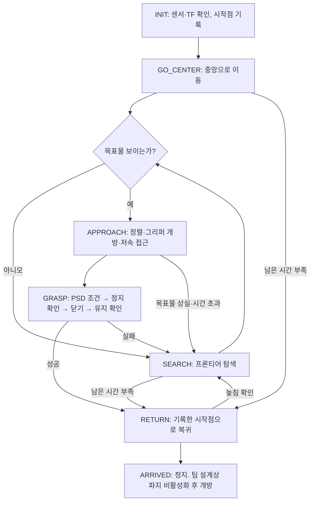

# 미션1 제어 설계 — SLAM · Nav2 · D415 연결

**갱신일:** 2026-09-16
**상태:** Claude 작성. Nav2 경로와 시각 서보는 가상 입력으로 검증했고, D415는 **실물 카메라 미검증**입니다.
**근거:** `README.md`의 미션1 작동 방식, `Agent.md`, `docs/competition_rules.md`
**이번에 추가한 코드:** `src/cwu_nav`, `src/cwu_perception`, `cwu_slam`의 장착 TF·데모 변경

> [!important] 카메라 역할 변경 (2026-09-16, 사용자 확정)
> 카메라는 **깊이를 측정하지 않습니다.** 컬러 영상으로 목표물이 **어느 쪽에 있는지**만
> 판단하고, 목표물이 화면 세로 중심선에 오도록 모터를 계속 제어합니다.
> "얼마나 남았는가"는 그리퍼 PSD가 답합니다.
> 그래서 `/target/pose`(3D 위치)가 없어지고 `/target/bearing`(단위 방향)이 그 자리를 대신하며,
> `APPROACH`는 Nav2 목표 좌표 주행이 아니라 시각 서보가 됩니다.

> [!warning] 이 설계가 지금 움직이지 못하는 이유
> `/cmd_vel`을 모터로 보내는 노드가 없습니다. Nav2는 속도를 계산해 발행하지만
> 실물 로봇은 그대로 서 있습니다. 모터 브리지와 MCU 프로토콜은 계획의 Phase 1b이고,
> 엔코더 실측값(`encoder.yaml`)이 나오기 전에는 시작할 수 없습니다.
> 아래 설계는 그 자리를 비워 두고 **양쪽 경계를 확정**하는 것이 목적입니다.

## 1. 제어 계층

미션 판단, 경로 주행, 안전 정지를 한 노드에 넣지 않습니다. 주기와 실패 방식이 다릅니다.

| 계층 | 주기 | 담당 | 실행 주체 |
|---|---|---|---|
| 미션 상태머신 | 1–5 Hz | "지금 무엇을 할 차례인가" — 탐색·접근·파지·복귀 전이 | `cwu_mission1` (**미구현**) |
| 주행 | 10 Hz | "어디로 어떻게 갈 것인가" — 경로 계획·추종·회피 | Nav2 기성 스택 (`cwu_nav`) |
| 목표물 정렬 | 20 Hz | "목표물이 중심선에서 얼마나 벗어났는가" — 회전·저속 전진 | `cwu_nav/target_follower` (**이번 추가**) |
| 안전 감시 | 20 Hz 이상 | "지금 멈춰야 하는가" — 근접·경계·명령 만료 | `cwu_safety` (**미구현**) |
| 구동 | MCU | 바퀴 속도와 그리퍼 | Nucleo 펌웨어 (**미구현**) |

상위 계층이 죽어도 하위 계층은 스스로 멈춰야 합니다. 안전 감시자는 미션 상태머신의
판단을 기다리지 않고 `/cmd_vel`을 차단하며, MCU는 명령이 끊기면 자체 타임아웃으로 멈춥니다.

## 2. 노드와 인터페이스

```text
G4 드라이버 ─ /scan ─────────────────┬─ SLAM Toolbox ─ /map, map → odom
cwu_base/encoder_odom ─ /odom, odom → base_link ─┘        │
                                                          ├─ Nav2 global/local costmap
D415 ─ color ─ target_detector ─ /target/bearing ─ target_follower ─ /cmd_vel_servo
                                                          ↓
                          미션 상태머신 ─ NavigateToPose 액션 ─ Nav2
                                                          ↓
              Nav2 /cmd_vel ┐
                            ├─ 안전 감시자 ─ /cmd_vel_safe ─ 모터 브리지 ─ MCU
        서보 /cmd_vel_servo ┘
```

주행 명령을 내는 곳이 둘입니다. 탐색·복귀는 Nav2가, 목표물 접근은 시각 서보가 냅니다.
둘 중 무엇을 모터로 보낼지는 **안전 감시자가 미션 상태를 보고 고릅니다**(6장).

| 인터페이스 | 제공자 | 상태 |
|---|---|---|
| `/scan` (`sensor_msgs/LaserScan`, `laser_frame`) | G4 드라이버 | 구현·실물 검증(2026-09-10) |
| `/odom` + `odom → base_link` | `cwu_base/encoder_odom` | 구현·실물 미검증(실측값 미입력) |
| `base_link → laser_frame` | `cwu_slam` 정적 TF (`mount.yaml`) | 구현·**미보정(전부 0)** |
| `base_link → camera_link` | `cwu_perception` 정적 TF (`mount.yaml`) | **이번 추가**·**미보정(전부 0)** |
| `/map` + `map → odom` | SLAM Toolbox | 구현·가상 검증 |
| `/target/bearing` (`geometry_msgs/PointStamped`, 컬러 광학 프레임 단위 방향) | `cwu_perception/target_detector` | **이번 추가**·합성 입력 검증 |
| `/cmd_vel_servo` (`geometry_msgs/Twist`) | `cwu_nav/target_follower` | **이번 추가**·합성 입력 검증 |
| `navigate_to_pose` (`nav2_msgs/action/NavigateToPose`) | Nav2 `bt_navigator` | **이번 추가**·가상 입력 검증 |
| `/cmd_vel` (`geometry_msgs/Twist`) | Nav2 `velocity_smoother` | **이번 추가**·실물 소비자 없음 |
| `/cmd_vel_safe` | `cwu_safety` | **미구현** |
| `/gripper/range`, 그리퍼 명령 | `cwu_gripper` | **미구현** (PSD 설계 초안 참조) |

TF별 발행자는 여전히 하나씩입니다. Nav2는 TF를 만들지 않고 읽기만 합니다.

`/target/bearing`은 **카메라 광학 프레임 그대로** 나갑니다(REP-145: +z 전방, +x 우측, +y 하방).
검출기 안에서 `base_link`로 바꾸지 않는 이유는, 변환에 필요한 TF가 장착 보정값에 달려 있어
검출 실패와 보정 실패가 같은 증상으로 섞이기 때문입니다. 소비자가 TF로 변환합니다.

길이가 1인 **방향 벡터**이지 위치가 아닙니다. 거리를 모르는 채로 `PoseStamped`를 내보내면
없는 거리를 있는 척하게 되고, 소비자가 그 값을 좌표로 오해합니다. 좌우 정렬에는 x 성분만,
서보에는 `atan2(x, z)` 하나만 있으면 됩니다.

목표물이 안 보이면 **발행하지 않습니다.** "못 봤다"는 메시지를 따로 내지 않는 이유는,
소비자가 어차피 표본 나이로 판단해야 하기 때문입니다(노드가 죽어도 같은 증상이어야 합니다).

## 3. 미션1 상태 전이

README의 6단계를 그대로 상태로 옮깁니다.



| 상태 | 입력 | 출력 | 전이 조건 | 시간 상한(초안) |
|---|---|---|---|---|
| `INIT` | `/scan`, `/odom`, TF 전부 | 없음 | 모든 TF 조회 성공 + `map → base_link` 안정 후 **시작점 기록** | 15 |
| `GO_CENTER` | `/map`, `/target/bearing` | `NavigateToPose` | 중앙 도달 또는 목표물 검출 | 90 |
| `SEARCH` | `/map` 프론티어 | `NavigateToPose` | 목표물 검출 | 240 |
| `APPROACH` | `/target/bearing` | Nav2 목표 취소 → 감시자를 서보 입력으로 전환, 그리퍼 개방·파지 활성화 | PSD 조건 성립 → `GRASP` | 45 |
| `GRASP` | `/gripper/range`, 주행 상태, 그리퍼 피드백 | 정지 요청, 닫기 요청 | 유지 확인 → `RETURN` | 20 |
| `RETURN` | 기록한 시작점 | `NavigateToPose` | 도착 | 150 |
| `ARRIVED` | 위치·유지 상태 | 정지, 파지 비활성화 후 개방 | 종료 | — |

시간 상한은 **아직 근거 없는 초안**입니다. 실제 주행 속도와 검출 유효 거리를 재고 나서
10분(600초)을 다시 배분합니다. 규정 14항상 시간이 끝나면 목표물–시작점 거리로 승패가
갈리므로, 남은 시간이 부족하면 잡지 못한 상태에서도 복귀 방향으로 미는 편이 유리합니다.

### 접근은 좌표 주행이 아니라 시각 서보입니다 (`APPROACH`)

거리를 모르므로 "목표물 앞 0.3 m"라는 목표 좌표를 만들 수 없습니다. 대신 화면 좌우
오차를 0으로 만드는 제어를 겁니다.

```text
오차 = atan2(x, z)                     # /target/bearing, 세로 중심선 기준
angular.z = clamp(-k_yaw · 오차, ±max_yaw)
linear.x  = 오차가 align_tol 안이면 approach_speed, 아니면 0
표본이 sample_timeout_s보다 오래되면 (0, 0)
```

정렬 전에 전진하지 않는 이유는, 비스듬히 다가가면 목표물이 화면 가장자리로 밀려
상실 구간이 길어지기 때문입니다. 제자리 회전이 먼저입니다.

**`APPROACH` 진입 조건에 거리 임계가 없습니다.** 보이면 들어갑니다. 나가는 길은 세 가지뿐입니다:
PSD 파지 조건 성립(`GRASP`), 목표물 상실, 시간 초과. 앞의 하나만 성공이고 나머지는 `SEARCH`입니다.

전진을 멈추라고 말해 주는 센서가 PSD 하나뿐이므로 `approach_speed`는 0.08 m/s로 잡았습니다
(Nav2의 0.26 m/s 대비). PSD 반응 시간과 제동거리를 재기 전에는 이 값을 올리지 않습니다.

### 시작점 기록 (`INIT`)

부팅 위치를 경기 시작점으로 **가정하지 않습니다**. 대회에서는 로봇을 놓고 나서 실행
명령을 받으므로, 실행 시점의 `map → base_link`를 한 번 읽어 기억합니다. 좌표를
하드코딩하지 않으므로 `(1,9)`·`(9,1)` 어느 쪽을 배정받아도 같은 코드가 돕니다(규정 2.3).

SLAM이 루프 클로저로 지도를 다시 맞추면 `map` 좌표계 자체가 움직입니다. 따라서 시작점은
저장한 좌표 그대로 쓰되, 복귀 정확도는 **실물 왕복 시험으로 확인해야 하는 열린 항목**입니다.

### 경기장 좌표계 추정 (`GO_CENTER`)

SLAM 원점은 로봇이 켜진 자리일 뿐 경기장 중앙이 아닙니다. 벽 4면을 관측해 3.6 m 정사각형을
맞춘 뒤에야 중앙 `(5,5)`가 나옵니다. 맞추기 전에는 `SEARCH`로 돕니다.
**이 벽 정합은 아직 구현돼 있지 않습니다.**

## 4. Nav2 설정에서 실제로 결정한 것

`src/cwu_nav/config/nav2.yaml`. 플래너·컨트롤러는 자작하지 않고 기성품만 씁니다.

| 항목 | 값 | 이유 |
|---|---|---|
| 컨트롤러 | Regulated Pure Pursuit | DWB의 궤적 샘플링은 Pi 4 4GB에서 SLAM·D415와 같이 돌리기에 비쌉니다 |
| 플래너 | NavFn (A*), `allow_unknown: true` | 미탐색 영역을 지나는 경로가 나와야 프론티어 탐색이 됩니다 |
| 전역 코스트맵 | `rolling_window: false`, static layer가 `/map` 구독 | 사전 지도 금지(규정 2.3). 크기·원점을 SLAM이 정합니다 |
| 지역 코스트맵 | 2.5 × 2.5 m rolling | 경기장이 3.6 m라 더 키울 이유가 없습니다 |
| `robot_radius` | 0.22 m | 규정 4.1의 Ø400 mm 상한이 0.20. 그리퍼·배선 여유로 0.22 |
| `inflation_radius` | 0.35 m | 400 mm 통로는 지름 0.44 m 로봇이 어차피 못 지납니다. 더 키우면 800 mm 통로까지 막힙니다 |
| `desired_linear_vel` | 0.26 m/s | 제동거리 실측 전 보수적 초기값 |
| `xy_goal_tolerance` | 0.10 m | Nav2는 "접근을 시작할 위치"까지만 책임집니다. 50 mm 큐브 정렬은 파지 접근 제어의 몫 |
| 후진 | 금지 | LiDAR 사각과 그리퍼 충돌 위험 |

### 지도 없이 Nav2를 쓰는 구성

`map_server`와 AMCL을 띄우지 않습니다. 위치 추정은 SLAM Toolbox의 `map → odom`이 그대로 맡고,
Nav2는 그 위에서 경로만 만듭니다. 그래서 `nav2.launch.py`는 `nav2_bringup`의
`navigation_launch.py`(주행 전용)를 포함하고 `bringup_launch.py`(지도+위치추정 포함)는 쓰지 않습니다.

### G4의 `0.0` 무효값 처리

G4는 무효 측정을 `inf`가 아니라 `0.0`으로 돌려줍니다(README 3장, 930점 중 절반가량).
코스트맵의 `obstacle_min_range: 0.12`가 이보다 크므로 `0.0`은 자동으로 버려집니다.
`inf_is_valid: false`도 함께 둡니다. **이 조합은 실물 `/scan`으로 확인해야 하는 항목입니다.**
잘못되면 로봇 바로 앞에 유령 장애물이 깔려 아무 데도 못 갑니다.

## 5. 카메라 연결에서 실제로 결정한 것

`src/cwu_perception/config/realsense.yaml`, `target.yaml`, `src/cwu_nav/config/servo.yaml`.

- **깊이 스트림을 껐습니다** (`enable_depth: false`, `align_depth.enable: false`).
  카메라의 역할이 방향 하나로 좁혀졌으므로, 쓰지 않는 스트림을 Pi 4에서 돌릴 이유가 없습니다.
  깊이와 정렬은 포인트클라우드 다음으로 비싼 항목입니다. 되돌리려면 플래그 둘이며,
  규정 2.3상 **경기장 공개 전에만** 가능합니다.
- **해상도 424×240 @ 15 fps, 컬러만.** 목표물은 단색 큐브 하나이고 검출은 HSV 마스크입니다.
  방향만 필요하므로 화소가 더 필요하지 않습니다.
- **출력은 단위 방향 벡터.** 거리를 주장하지 않는 유일한 형태입니다.
- **중앙값 깊이 표본, 최소 깊이 임계가 사라졌습니다.** 깊이를 안 읽으므로 `min_depth_m`,
  `max_depth_m`, `depth_scale`, `max_sync_s`가 모두 필요 없습니다. 컬러·깊이 시각 동기화도
  마찬가지입니다(맞출 짝이 없습니다).
- **서보는 고정 주기로 발행합니다**(`rate_hz: 20`). 검출 콜백에서만 내보내면 목표물을
  놓쳤을 때 마지막 명령이 남아 로봇이 계속 돕니다. 표본이 끊긴 것 자체가 0을 만들어야 합니다.
- **`min_yaw: 0.0`.** 정지 마찰을 넘기는 최소 각속도 자리를 비워 둔 것입니다. 작은 오차에서
  모터가 울기만 하고 안 돌면 이 값을 올립니다. 실측 전에는 끕니다.

### 깊이를 버리면서 같이 버린 것

거리 기반 접근 판정이 없어졌습니다. 이전 설계에서 `APPROACH` 진입·감속·정지는 모두
깊이 임계로 할 수 있었지만, 이제 **접근 중 유일한 거리 정보는 PSD뿐**입니다.
PSD가 늦거나 안 잡히면 로봇은 목표물을 밀고 지나갑니다(규정 7.1: 장애물을 밀면 실격이며,
목표물은 장애물이 아니지만 밀어내면 파지가 불가능해집니다).

이 위험을 줄이는 값은 `approach_speed` 하나입니다. PSD 실측 전에는 낮게 둡니다.

### 코스트맵에 카메라를 넣지 않은 이유

벽과 장애물은 모두 높이 200 mm이고 G4는 100–150 mm에 답니다. G4가 이미 전부 봅니다.
깊이가 꺼져 있으므로 `depthimage_to_laserscan`도 지금은 쓸 수 없습니다. 200 mm보다 낮거나
높은 물체를 피해야 한다고 판명되면, 그때는 깊이를 다시 켜는 것부터 결정해야 합니다
(경기장 공개 전에). 그 경우 Pi 4 자원 측정을 다시 합니다.

50 mm 큐브는 G4 아래에 있어 `/scan`에 잡히지 않습니다. 이것은 문제가 아니라 유리한 점입니다.
목표물이 코스트맵에 장애물로 찍히면 Nav2가 접근 자체를 피합니다.

### 장착 각도(pitch)가 이제 더 중요해졌습니다

깊이가 있을 때는 목표물이 화면 어디에 있든 좌표가 나왔습니다. 이제는 **화면에서 사라지면
제어가 끊깁니다.** 카메라를 너무 내리면 먼 목표물이, 너무 세우면 접근 마지막 구간의
목표물이 시야에서 빠집니다. `mount.yaml`의 `camera_mount.pitch`는 0.3 m와 2 m에 큐브를 두고
**둘 다 보이는 각도**를 찾아 넣어야 하는 실측 항목입니다.

그래도 마지막 수십 mm는 목표물이 시야 아래로 빠질 가능성이 큽니다. 그 구간은 열린 루프
전진 + PSD이며, 실측으로 구간 길이를 재야 합니다.

### 경기장 공개 전에 반드시 끝내야 하는 것

`rgb_camera.enable_auto_exposure`와 `enable_auto_white_balance`가 지금 **켜져 있습니다.**
규정 2.3상 경기장 공개 후에는 파라미터를 못 고치므로, 자동 보정을 켠 채로 들어가면
조명이 바뀌어 HSV 임계가 흔들려도 손쓸 방법이 없습니다. 같은 조명에서 수렴값을 읽어
고정값으로 바꾸는 절차를 `realsense.yaml` 주석에 적어 두었습니다.
지금 임의의 노출값을 넣으면 화면이 까맣게 나와 더 나쁘므로, 미측정 상태에서는 자동을 둡니다.

## 6. 안전 감시자 (미구현, 경계만 확정)

`/cmd_vel`을 그대로 모터로 보내지 않습니다. 감시자가 받아 `/cmd_vel_safe`로 내보내며,
아래 중 하나라도 걸리면 0을 발행합니다.

1. `/scan`의 전방 최소 거리가 정지 임계 미만 (규정 7.1: 장애물을 밀면 실격)
2. `map` 기준 위치가 경기장 경계 밖으로 나가는 방향
3. Nav2 명령이 만료됨 (일정 시간 수신 없음)
4. `/scan`·`/odom`·TF 중 하나가 끊김
5. 미션 상태머신이 정지를 요청함 (PSD 파지 흐름의 "주행 정지 요청")

MCU도 같은 만료 정지를 자체적으로 가져야 합니다. Pi가 죽으면 감시자도 같이 죽기 때문입니다.
현재 `encoder_odom`의 통신 끊김 처리는 **오류 로그뿐이고 모터 정지가 아닙니다.**

### 감시자가 입력도 고릅니다

주행 명령 발행자가 둘(Nav2의 `/cmd_vel`, 서보의 `/cmd_vel_servo`)이므로 하나를 골라야 합니다.
이 역할을 별도 mux 노드가 아니라 감시자에 넣은 이유는, 어차피 **모터로 가는 유일한 관문**이
감시자이고 노드를 하나 더 띄우면 Pi 4에서 프로세스와 지연만 늘기 때문입니다.

- 기본값은 Nav2입니다. 미션 상태머신이 `APPROACH`를 알릴 때만 서보로 바꿉니다.
- 전환 시점에 미션 상태머신은 Nav2 목표를 **취소**합니다. 취소가 지연되는 동안에도
  모터로 나가는 것은 감시자가 고른 하나뿐입니다.
- 선택된 쪽이 끊기면(만료) 0입니다. 다른 쪽으로 자동으로 넘어가지 않습니다.
  목표물 상실은 미션 상태머신이 상태를 바꿔 처리할 일이지, 감시자가 대신 결정할 일이 아닙니다.
- 정지 조건 다섯 가지는 어느 쪽을 고르든 그대로 적용됩니다.

서보는 항상 발행합니다(활성/비활성 스위치가 없습니다). 선택이 감시자 한 곳에서만
일어나면 "누가 모터를 잡고 있는가"를 한 군데만 보면 되기 때문입니다.

## 7. 이번에 연결한 것과 남은 것

**연결함**

- Nav2 기성 스택 설정·런치 (`cwu_nav`), 온라인 SLAM 위에서 사전 지도 없이 동작하는 구성
- D415 드라이버 설정·장착 TF·빨간 목표물 검출기 (`cwu_perception`) → `/target/bearing` (방향만)
- 목표물 정렬 시각 서보 (`cwu_nav/target_follower`) → `/cmd_vel_servo`
- LiDAR·카메라 장착값을 `mount.yaml` 한 파일에서 읽는 공용 로더 (`cwu_slam/mounts.py`)
- 가상 센서의 `/cmd_vel` 주행 모드 — Nav2 속도가 실제 이동으로 이어지는지 하드웨어 없이 확인
- 전체 스택 한 번에 실행: `ros2 launch cwu_nav autonomy.launch.py`

**남은 것 (순서대로)**

1. `encoder.yaml` 실측값 → 모터 브리지·MCU 안전 정지 (Phase 1b). 이게 없으면 Nav2는 계산만 합니다.
   Nav2 쪽 인터페이스는 확정됐습니다: `/cmd_vel`(`geometry_msgs/Twist`)을 받으면 됩니다.
2. `mount.yaml`의 LiDAR·카메라 장착값 실측. 지금 전부 0입니다.
   카메라 pitch는 깊이를 버린 뒤로 더 중요해졌습니다(5장).
3. Pi 4에서 SLAM + Nav2 + D415 동시 실행 CPU·메모리·온도 측정 (계획 Phase 2의 진짜 산출물)
4. `cwu_safety` — `/cmd_vel` 게이트 **와 Nav2/서보 선택**
5. `cwu_gripper` — PSD·그리퍼 (미지수 D·E 확정 후)
6. `cwu_mission1` — 위 상태머신. 벽 정합에 의한 경기장 좌표계 추정 포함
7. 조명별 노출·화이트밸런스 고정과 HSV 임계 실측
8. 서보 상수(`servo.yaml`) 실주행 정정 — `k_yaw` 진동 여부, `min_yaw` 정지 마찰,
   `approach_speed`와 PSD 반응 시간의 관계

## 8. 검증

```bash
colcon build --symlink-install --executor sequential
colcon test --packages-select cwu_slam cwu_base cwu_perception cwu_nav --event-handlers console_direct+
colcon test-result --verbose

# SLAM (기존)
python3 src/cwu_slam/test/run_demo_check.py --backend slam_toolbox
# 인식 경로: 합성 컬러 프레임 → /target/bearing
python3 src/cwu_perception/test/run_detector_check.py
# 정렬 경로: 합성 /target/bearing → /cmd_vel_servo
python3 src/cwu_nav/test/run_follower_check.py
# 주행 경로: SLAM → Nav2 → /cmd_vel → 실제 이동 → 복귀 (Nav2 설치 필요)
python3 src/cwu_nav/test/run_nav2_check.py
```

**2026-09-16 카메라 역할 변경 후 실행 결과 (개발 PC):** 빌드 4개 패키지 통과,
단위 테스트 48개 통과(기존 41 + 서보 8, 검출기 깊이 시험 3개 제거·방향 시험 5개 추가).

```text
검출기 검사   PASS  중앙 /target/bearing = (-0.002, -0.002, 1.000), 컬러 광학 프레임
              PASS  우측 목표물 = (0.163, -0.002, 0.987) — 부호 확인
서보 검사     PASS  우측 목표물 → angular.z=-0.556, linear.x=0.000 (정렬 전 전진 없음)
              PASS  중심선 정렬 → angular.z=-0.000, linear.x=0.080
              PASS  표본 만료(0.5 s) → 정지 명령
```

**이번에 다시 돌리지 않은 것:** SLAM 가상 검사와 Nav2 주행·복귀·장애물 검사는 이 변경이
건드리지 않는 경로라 재실행하지 않았습니다. 아래는 변경 전 기록입니다.

```text
SLAM 가상 검사   PASS  map=72x72, free=3792, occupied=152; 지도 저장까지 확인
Nav2 주행 검사   PASS  (0.93, -0.73) 도달, 오차 0.10 m
Nav2 복귀 검사   PASS  (0.07, -0.06) 도달, 오차 0.09 m
Nav2 장애물 검사 PASS  상자 안 (1.10, 1.10) 주행 거부됨 status=6 (ABORTED)
```

마지막 항목이 코스트맵 검증입니다. 상자가 코스트맵에 안 찍혔다면 Nav2가 그냥 통과해
성공했을 것입니다. 플래너가 경로를 못 내고 중단했으므로 장애물 계층이 동작합니다.

서보 검사의 마지막 항목이 "안 보이면 멈춘다"를 확인합니다. 발행을 검출 콜백에 걸어 뒀다면
표본이 끊긴 뒤 마지막 명령이 남아 로봇이 계속 돌았을 것이고, 이 검사가 그것을 잡습니다.

**미검증:** RealSense 드라이버가 미설치라 `realsense.yaml`의 파라미터 이름이 실제
`realsense2_camera` 버전과 맞는지 확인되지 않았습니다. 깊이를 끈 구성(`enable_depth: false`)이
드라이버에서 실제로 컬러만 열어 CPU를 줄이는지도 실물에서 재야 합니다.
서보 상수는 전부 책상 위 값이며, 실제 관성·마찰에서 진동하지 않는지는 실주행 항목입니다. 실물 `/scan`에서의 코스트맵 동작,
실물 주행, Pi 4 자원은 모두 미검증입니다. 가상 `/scan`은 G4의 `0.0` 무효값을 재현하지
않으므로 위 장애물 검사는 그 위험을 확인해 주지 않습니다.

### Nav2 토픽 경로 (확인 완료)

`navigation_launch.py`의 리매핑을 직접 확인했습니다.
`controller_server → /cmd_vel_nav → velocity_smoother → /cmd_vel`.
최종 출력이 `/cmd_vel`이 맞으므로 안전 감시자와 모터 브리지는 이 토픽을 받으면 됩니다.

### 이번 변경에서 드러난 것 (수정 완료)

검사 스크립트가 노드 쪽에만 `ROS_DOMAIN_ID`·`ROS_LOCALHOST_ONLY`를 걸고 자기 자신에게는
걸지 않았습니다. 셸 환경이 다르면 서로 안 보이는데 증상은 "발행이 없다"로 나옵니다.
→ `run_detector_check.py`·`run_follower_check.py`가 `os.environ`에도 같은 값을 넣습니다.
`run_nav2_check.py`와 `run_demo_check.py`에도 같은 문제가 남아 있습니다(이번 변경 범위 밖).

### 이전 검사에서 드러난 설정 오류 세 가지 (수정 완료)

가상 검사를 돌리지 않았다면 실물에서 처음 만났을 것들입니다.

1. **`use_composition=True`인데 컨테이너가 없어 Nav2가 조용히 하나도 안 떴습니다.**
   `navigation_launch.py`는 노드를 실을 뿐 컨테이너를 만들지 않습니다(그건 `bringup_launch.py`의 몫).
   오류도 없이 아무 일도 일어나지 않는 것이 가장 나쁜 실패 방식입니다.
   → `nav2.launch.py`가 `nav2_container`를 직접 띄우게 했습니다.
2. **`local_costmap`의 `width: 2.5`.** Nav2는 `width`/`height`를 정수(m)로 선언합니다.
   `controller_server`만 타입 오류로 컨테이너에 실리지 않았습니다. → `3`으로 수정.
3. **`bt_navigator`의 `plugin_lib_names` 하드코딩.** 목록을 적으면 기본값을 통째로 덮어쓰므로
   기본 BT가 쓰는 `RemovePassedGoals`가 빠져 configure에서 죽었습니다.
   → 목록을 삭제하고 Nav2 기본값을 씁니다. 전용 BT를 쓸 때만 필요한 것을 추가합니다.

### 남은 잡음

종료 시 컴포즈된 lifecycle 노드들이 상태 전환에 실패하고 컨테이너가 SIGKILL까지 갑니다.
`Goal succeeded` 이후 Ctrl+C 시점에만 발생하며 주행 결과에 영향이 없습니다.
Nav2 컴포지션의 알려진 종료 경합입니다.

## 관련 문서

- [[Agent|개발 원칙]]
- [[README|빌드 및 실행 절차]]
- [[docs/competition_rules|대회 규정]]
- [[docs/superpowers/plans/2026-09-10-competition-plan|대회 개발 계획]]
- [[docs/superpowers/specs/2026-09-16-psd-gripper-design|PSD 자동 파지 설계 초안]]
