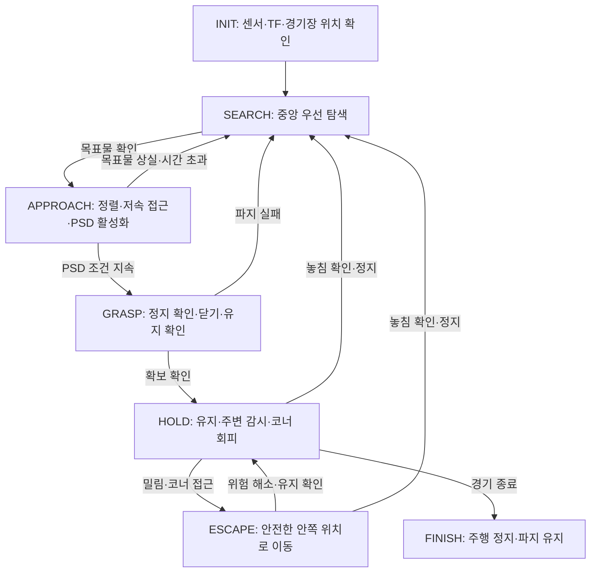

# 미션2 제어 설계 — 목표물 확보·유지·코너 회피

**갱신일:** 2026-09-16
**상태:** codex 설계 초안. Claude 검토·미션2 구현·실물 검증 전입니다.
**근거:** [[README#미션 2 — 중앙 목표물을 확보하고 종료까지 유지 (5분)|README 작동 방식]], [[Agent|개발 원칙]], [[docs/competition_rules|대회 규정]] 15–26항.

네 로봇이 내부 장애물이 없는 경기장에서 경쟁합니다. 중앙의 빨간 목표물을 찾아 잡고,
5분 종료 시점까지 유지하는 것이 목표입니다. 미션1과 같은 센서·그리퍼·온보드 컴퓨터를 사용합니다.
미션1의 시작점 복귀 대신 **확보 유지와 모서리 탈락 회피**가 파지 이후의 동작입니다.

> [!warning] 현재 구현 범위
> 기존 SLAM·엔코더 처리·Nav2 설정·D415 목표물 검출을 재사용하는 설계입니다.
> 미션2 상태머신, 경기장 좌표계 추정, 상대 추적, 코너 회피, 안전 감시, 모터 브리지,
> PSD·그리퍼 제어는 아직 미구현입니다. 이 문서를 저장해도 실물 로봇이 자율주행하는 것은 아닙니다.

## 1. 제어 계층과 센서 역할

미션1처럼 미션 판단 → 주행 → 안전 감시 → MCU 구동으로 구분합니다.
`cwu_mission2`는 향후 미션 판단을 담당할 이름이며 현재 패키지는 없습니다.
센서는 차례로 켜는 것이 아니라 계속 데이터를 보내며, 각 단계에서 사용하는 판단이 달라집니다.

| 구성 | 미션2에서 하는 일 | 한계·조건 |
|---|---|---|
| G4 LiDAR | 벽과 주변 물체 거리 관측, 위치 추정과 상대 접근 감시에 사용 | 거리만으로 상대의 정체를 확정하지 않음. 스캔 높이에 걸리지 않는 물체는 놓칠 수 있음 |
| 좌우 엔코더 | 바퀴 이동·회전량으로 `/odom`과 TF 제공 | 외력으로 미끄러지거나 들리면 실제 이동과 달라질 수 있음 |
| SLAM·경기장 위치 추정 | G4와 엔코더 기반 TF로 자기 위치를 추정하고 벽 관측으로 중앙·코너 계산 | SLAM 원점은 경기장 중앙이 아님. 벽 정합은 추가 구현 필요 |
| D415 | 빨간 목표물 확인과 **방향** 추정(컬러만, 깊이 미사용). 정렬은 시각 서보가 수행 | 상대 로봇의 빨간 부분·가림·근접 시 화면 이탈에 대한 실물 검증 필요 |
| 그리퍼 PSD | 정렬된 목표물이 집는 거리로 들어왔는지 확인 | 목표물 식별과 확보 성공 판정은 하지 않음 |
| 그리퍼 피드백 | 닫힘 완료, 실제 유지·놓침 판단 | 사용할 피드백·구동기·프로토콜 미확정 |

## 2. 노드와 인터페이스

기존 연결은 [[docs/superpowers/specs/2026-09-16-mission1-control-design|미션1 제어 설계]]를 재사용합니다.

| 입력·출력 | 연결과 역할 | 상태 |
|---|---|---|
| `/scan`, `/odom`, TF, `/map` | 주변 관측·자기 위치 → 미션 판단·Nav2 | 기존 구현, 미션2 동적 환경 미검증 |
| `/target/bearing` | D415 검출 → 정렬 제어. 컬러 광학 프레임의 단위 방향이며 거리 정보가 없습니다 | 기존 구현, 실물 미검증 |
| `/cmd_vel_servo` | 시각 서보 출력. 안전 감시자가 Nav2 `/cmd_vel`과 이 토픽 중 하나를 고릅니다 | 기존 구현, 실물 미검증 |
| `navigate_to_pose` | 미션 판단 → Nav2 이동 목표 | 기존 Nav2 인터페이스 |
| `/cmd_vel` → `/cmd_vel_safe` | 주행 명령 → 안전 감시 → 모터 브리지 → MCU | 안전 감시 이후 경로 미구현 |
| `/gripper/range` | PSD 거리 → 자동 파지 판단 | `sensor_msgs/Range` 사용 초안, 미구현 |
| 파지 활성화·개폐·유지 상태 | 미션 판단 ↔ 그리퍼 제어 | 하드웨어 확인 후 인터페이스 확정 |

상대 추적과 코너 금지영역의 인터페이스는 미정입니다. 현재 Nav2 설정만으로
미션2의 동적 회피·탈락 방지가 완성됐다고 보지 않습니다. 접근 제어를 별도로 추가할 경우
Nav2 목표를 취소하고 명령 주체를 전환해 두 제어기가 동시에 속도를 보내지 않게 합니다.

## 3. 미션2 작동 순서와 상태 전이

도식은 정상 흐름입니다. 아래 공통 안전·종료 조건은 **모든 상태에 우선** 적용합니다.

| 순서·상태 | 센서 입력과 판단 | 동작·다음 단계 |
|---|---|---|
| 1. `INIT` | G4·엔코더·TF의 유효성, 벽 관측 기반 위치 확인 | 자동 파지를 끈 상태로 시작. 중앙·코너를 판단할 위치 신뢰도를 확보한 뒤 탐색 |
| 2. `SEARCH` | G4로 주변 감시, D415로 목표물 탐색 | 경기장 좌표계가 확인되면 중앙 우선 접근. 목표물이 이동했으면 마지막 관측 위치와 안전한 영역을 재탐색 |
| 3. `APPROACH` | D415 목표물·정렬 상태, PSD 유효 거리, 주변 여유 | 그리퍼 개방·재활성화 후 저속 접근. PSD 조건이 지속되면 정지 요청 후 `GRASP` |
| 4. `GRASP` | 실제 정지, 목표물·PSD 조건 재확인, 그리퍼 피드백 | 정지 확인 후 닫고 실제 유지 확인. 성공하면 `HOLD`, 실패하면 정지·파지 비활성화 후 제한된 재시도 또는 탐색 |
| 5. `HOLD` | G4 주변 변화, 자기 위치, 그리퍼 유지 상태 | 추가 닫힘 트리거를 막고 확보 유지. 안전한 위치를 유지하되 상대 접근·코너 위험에 따라 이동 |
| 6. `ESCAPE` | 코너까지 여유, 주변 물체, LiDAR 위치 변화와 엔코더의 불일치 | 파지를 유지하며 통행 가능한 안쪽 위치로 이동. 중앙이 막혔으면 무조건 중앙으로 돌진하지 않음 |
| 7. `FINISH` | 온보드 경기 시간 | 주행 정지·자동 파지 비활성화. 잡은 목표물은 자동으로 놓지 않고 판정을 위해 유지 |

목표물 상실·파지 실패 시에는 기존 이동을 취소하고 정지한 뒤 탐색으로 전환합니다.
`SEARCH`·`APPROACH`에서도 코너 위험이 생기면 확보 여부를 보존한 채 안전 이동을 우선하고,
위험 해소 후 미확보 상태는 탐색으로 돌아갑니다.

경기 종료는 어떤 상태에서든 `FINISH`로 전환합니다. 경기 시간은 온보드 단조 시계의 경과시간으로
판단하며 외부 시각 동기화에 의존하지 않습니다. 기본 경기 300초와 동시 확보 재경기 180초는
규정 16·25항에 따른 별도 실행 모드로 사전 준비하고, 허용된 시작 명령에서 선택하는 절차를 확인합니다.
경기장 공개 후 설정 파일을 수정하지 않습니다.

## 4. 공통 PSD 파지와 유지 판정

[[docs/superpowers/specs/2026-09-16-psd-gripper-design|PSD 자동 파지 설계]]의 조건을 그대로 적용합니다.

1. D415로 목표물을 확인하고 시각 서보로 화면 중심선에 맞춘 뒤, 그리퍼를 열고 파지를 활성화합니다.
   카메라가 거리를 재지 않으므로 접근 중 거리 정보는 PSD뿐입니다.
2. 유효하고 최신인 PSD 근접 감지가 보정된 시간 동안 지속돼야 합니다.
3. 주행을 정지하고 실제 정지·목표물·거리 조건을 다시 확인한 뒤 닫습니다.
4. 닫힘 완료와 실제 유지가 확인돼야 확보 상태로 전환합니다.
5. 놓침이 확인되면 정지 후 재탐색·재정렬합니다. 상대 로봇의 PSD 접근만으로 재파지하지 않습니다.

PSD 오류만으로 이미 잡은 목표물을 열지 않습니다. 유지 상태를 알 수 없으면 성공이나 놓침으로
단정하지 않고 이동을 정지해 상태를 재확인합니다. 규정 19항의 확보 기준은 **로봇을 수직으로
들었을 때 목표물이 함께 들리는 것**이며, PSD 감지·닫힘 명령 완료만으로 이를 증명하지 않습니다.

## 5. 코너 회피·상대 접근·밀림 대응

- **코너:** 벽 관측으로 경기장 좌표계를 추정한 뒤 네 모서리의 400 × 400 mm 격자를 주행 금지영역으로 취급합니다. 규정 22항의 탈락 판정선까지 접근하는 전략 대신 로봇 외곽·그리퍼 돌출·위치 오차·제동거리를 포함한 여유를 둡니다. 여유값은 실측 후 YAML에 저장합니다.
- **위치 불확실:** 벽이 상대에게 가려지거나 위치가 튀면 코너 방향 주행을 중지하고 위치를 재확인합니다. 정지만으로 상대에게 밀리는 것을 막을 수는 없으므로 실물 접촉 시험이 필요합니다.
- **상대 후보:** 벽과 비교한 LiDAR 물체를 시간에 따라 추적합니다. 정지한 상대도 장애물로 취급하며, 지도에 없는 점 하나를 곧바로 상대라고 확정하지 않습니다. 이동 물체가 벽 정합을 오염시키는 경우도 시험합니다.
- **밀림:** 명령·엔코더 이동과 LiDAR 기반 위치 변화를 함께 비교합니다. 엔코더가 멈춰 있어도 차체가 밀릴 수 있고 SLAM 보정도 위치를 바꿀 수 있으므로 불일치만으로 충돌을 확정하지 않습니다.
- **대응:** 목표물 유지와 탈락 회피가 우선입니다. 밀기는 허용되지만 파손·센서 방해 전략은 사용하지 않습니다(규정 20·21항). 이번 초안은 회피 중심이며 적극 탈취 제어는 포함하지 않습니다.
- **재배치:** 상대의 탈락을 이유로 목표물이 정확히 중앙에 있다고 단정하지 않습니다. 규정 23항에 따라 중앙 주변에 재배치될 수도 있으므로 D415로 다시 확인합니다.

## 6. 안전 조건과 미확정 항목

모든 상태에서 센서·TF·주행 명령 만료, 위치 신뢰도 부족, 구동 오류가 발생하면
주행을 정지하고 새 파지를 금지합니다. MCU도 통신이 끊기면 자체적으로 모터를 정지해야 합니다.

확정할 항목은 PSD 모델·연결·거리 보정, 그리퍼 구동기·유지 피드백, MCU 프로토콜,
정지 확인 방법, 코너 여유·접근 속도·재시도 한도와 시간 제한입니다. 임의 수치를 넣지 않습니다.
모든 보정·튜닝은 경기장 공개 전에 YAML에 저장하며 두 미션의 하드웨어를 바꾸지 않습니다.
모든 판단은 Pi에서 실행하고 미션 중 SSH·웹 UI·외부 연산을 사용하지 않습니다.

## 7. 검증과 남은 구현

1. 미션1과 공통인 모터 브리지·MCU 만료 정지, 안전 감시, PSD·그리퍼 제어를 먼저 준비합니다.
2. 벽 정합·코너 금지영역·주변 물체 추적과 위 상태 전이를 구현합니다.
3. 하드웨어 없는 검사로 목표물 상실, PSD 무효·단절, 정지 실패, 파지 실패, 놓침·재확보, 모든 상태에서의 종료·안전 정지를 확인합니다.
4. 가상 주행으로 네 시작 위치, 상대의 가림·정지·이동, 코너 접근과 위치 추정 오류를 시험합니다. 구현 후 영향받는 패키지를 `colcon build`·`colcon test`로 검증합니다.
5. Pi 4에서 SLAM·Nav2·D415 동시 실행 부하와 제어 지연을 측정하고, 실물에서 들어올림 확보·밀림·회피·5분 유지 시험을 수행합니다.

**이번 문서 작업의 검증 범위:** 규정·기존 파지 설계와의 정합성, 문서 형식·링크 확인입니다.
미션1의 가상 주행 성공 기록을 미션2의 동작 검증으로 간주하지 않습니다.

## 관련 문서

- [[docs/superpowers/specs/2026-09-16-mission1-control-design|미션1 제어 설계]]
- [[docs/superpowers/specs/2026-09-16-psd-gripper-design|PSD 자동 파지 설계]]
- [[docs/superpowers/plans/2026-09-10-competition-plan|대회 개발 계획]]
- [[docs/competition_rules|대회 규정]]
- [[docs/프로젝트 목차|프로젝트 목차]]
