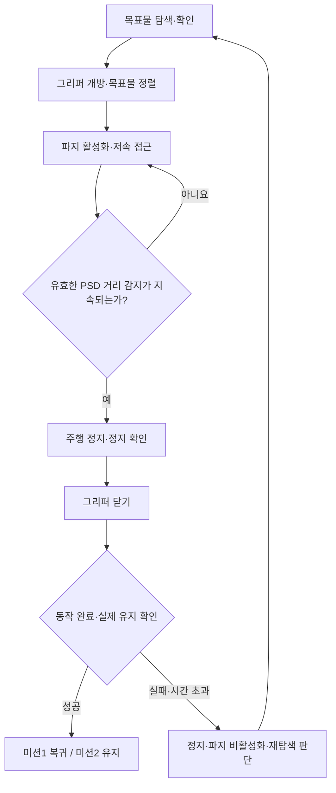

# PSD 센서 기반 그리퍼 자동 파지

**갱신일:** 2026-09-16
**상태:** codex 초안 — Claude 검토 및 실물 검증 대기
**사용자 확정 사항:** 그리퍼에 PSD 센서를 설치하고, 물체가 일정 거리 안에 들어오면 감지하여 자동으로 집습니다.
**구현 상태:** `cwu_gripper`, PSD 입력 드라이버, 그리퍼 MCU 펌웨어는 이 저장소에 아직 없습니다.

## 1. 센서와 제어의 역할

| 구성 | 역할 | 확인할 사항 |
|---|---|---|
| G4·엔코더·SLAM | 장애물 인식, 자기 위치와 이동 추정 | 기존 `/scan`, `/odom`, TF 경로 유지 |
| D415·목표물 인식 | 빨간 목표물의 **방향**을 제공(깊이 미사용). 정렬은 시각 서보가 수행 | 근접 접근 시 목표물이 화면에서 빠지는 구간 실측 |
| 그리퍼 장착 PSD | 집는 위치까지 들어온 물체의 거리 감지 | 모델, 측정 범위, 장착 방향·시야, 연결 방식 |
| 온보드 파지 제어 | 파지 활성 상태에서 거리 조건을 검사하고 정지·닫힘 요청 | Raspberry Pi에서 상태 판단, MCU에서 구동하는 통합 초안 |
| 그리퍼 구동기·피드백 | 개폐 및 유지, 동작 완료·오류 보고 | 구동기 종류, 행정·힘 제한, 실제 유지 판정 방법 |

PSD가 감지한 물체가 빨간 목표물인지는 D415 기반 인식·접근 상태로 확인합니다.
카메라가 거리를 재지 않으므로, **접근 중 유일한 거리 정보는 PSD뿐입니다.**
PSD가 늦으면 로봇이 목표물을 밀고 지나갑니다. 접근 속도를 낮게 잡은 이유가 이것입니다.
벽이나 상대 로봇이 가까워졌다는 이유만으로 탐색 중 그리퍼가 닫히지 않도록 합니다.
거리 감지는 **파지 시작 조건**입니다. 센서 앞에 물체가 있다는 것만으로 **확보 성공**을 보고하지 않습니다.

## 2. 자동 파지 흐름 (통합 초안)

- 시작 상태는 파지 비활성입니다. `APPROACH`에서 목표물이 정렬되고 그리퍼가 열린 뒤 활성화합니다.
- 센서 모델의 유효 측정 범위 안에서 `distance <= trigger_distance_m`가 `confirm_duration_s` 동안 지속되면 파지를 요청합니다. 무효·오래된 표본은 연속 감지 시간을 초기화합니다.
- 먼저 주행 정지를 요청하고 실제 정지가 확인되면 닫습니다. 정지 대기 중에도 거리·목표물 조건을 재확인합니다. 정지 확인 시간이 초과되면 닫지 않습니다.
- 닫는 중에는 PSD 입력이 반복돼도 닫힘 명령을 중복 시작하지 않습니다. 동작 완료와 유지 확인 후에만 `HOLDING`으로 전이합니다.
- PSD 통신 끊김·측정 불능·접근 시간 초과 시 접근을 정지하고 새 파지를 금지합니다. 이미 잡고 있다면 센서 오류만으로 자동 개방하지 않습니다.
- 닫힘 실패·구동 시간 초과는 오류로 보고합니다. 과도한 힘으로 계속 닫지 않으며, 재시도 횟수는 제한합니다.
- 놓기 요청 때는 먼저 파지를 비활성화합니다. 목표물이 센서 앞에 남아 있어도 다시 집지 않도록, 다음 파지 시도에 명시적으로 재활성화합니다.
- 파지 유지 중 놓침이 확인되면 정지 후 재탐색합니다. PSD로 유지 여부도 확인할 수 있는지는 실제 장착·시야 시험으로 결정합니다.

정지·파지·유지 판정은 아직 구현되지 않은 설계 조건입니다. 기존 엔코더 노드의 통신 오류 로그는 정지 확인을 대신하지 않습니다.

## 3. 연결 및 ROS 2 인터페이스

- PSD 입력의 온보드 처리 위치는 센서 인터페이스 확인 후 결정합니다. 아날로그 출력 모델이면 Nucleo ADC 연결을 우선 검토하고 공급 전압·출력 전압·입력 허용 범위를 확인합니다. 디지털 모델이면 실제 지원 버스를 따릅니다.
- Nucleo가 거리값·그리퍼 상태를 Pi로 전달하는 경우, 엔코더와 같은 직렬 포트는 **한 프로세스만** 읽습니다. 현재 `cwu_base/encoder_odom`이 포트를 직접 읽으므로 공유 프로토콜이 확정되면 그 수신 경로를 확장·분리합니다. 같은 포트를 여는 PSD 노드를 별도로 추가하지 않습니다.
- 거리 토픽 초안은 `/gripper/range`이며 `sensor_msgs/msg/Range`를 사용합니다. 거리 단위는 m, 센서 프레임과 측정 시각을 명시하고 유효 범위·시야각은 센서 사양과 장착에 맞춥니다. 원시 전압·ADC값을 거리값으로 그대로 발행하지 않습니다.
- 파지 활성화/해제, 개방 요청, 개폐 진행·유지·오류 상태가 미션 제어와 연결돼야 합니다. 최종 서비스/액션 및 MCU 메시지 형식은 구동기·프로토콜 확인 후 결정합니다.
- 이 변경으로 PSD를 SLAM의 `/scan`이나 엔코더 TF에 섞지 않습니다. `cwu_slam`의 지도 생성 인터페이스는 기존과 같습니다.

## 4. 설정과 미확정 하드웨어

추후 `cwu_gripper/config/gripper.yaml`에 아래 보정·튜닝값을 둡니다. 현재는 실행 코드가 없으므로 빈 설정 파일을 만들지 않습니다.

| 설정/정보 | 결정 근거 |
|---|---|
| PSD 모델·개수·출력 방식·공급/출력 전압 | 실제 부품 사양·배선 |
| 측정 최소/최대 거리·환산식 또는 보정표 | 해당 모델 데이터시트와 실측; 모델 공통 환산식 가정 금지 |
| `trigger_distance_m` | 센서 원점부터 물체까지의 거리와 실제 집을 수 있는 위치를 대조 |
| `confirm_duration_s`, `sensor_timeout_s` | 실제 표본 주기·흔들림·전달 지연 |
| 접근 속도·정지 대기 제한·접근 시간 제한 | 제동거리와 그리퍼 개구부 여유 |
| 개폐 위치·속도·힘/전류 제한·동작 시간 제한·재시도 한도 | 구동기와 기구의 허용 범위 |
| 파지 완료·유지·놓침 판정 | 실제 피드백 신호와 들어올리기·운반 시험 |

필수 보정값이 미설정이거나 감지 거리가 유효 범위를 벗어나면 자동 파지 활성화를 거부합니다.
감지 거리를 임의로 5 cm 같은 값으로 정하지 않습니다. 모든 보정은 경기장 공개 전에 완료합니다.

## 5. 양 미션에 반영

- **미션1:** `SEARCH → APPROACH → GRASP → RETURN → RELEASE`. `APPROACH`에서 PSD 감지 조건을 기다리고 `GRASP`에서 정지·닫기·유지를 확인합니다. 성공한 뒤 시작점으로 복귀하며, 도착 후 파지를 비활성화하고 개방합니다.
- **미션2:** 같은 `APPROACH`·PSD 감지·`GRASP`를 사용한 뒤 유지합니다. 놓침이 확인되면 재탐색하며 상대 로봇의 접근만으로 파지하지 않습니다.
- PSD·그리퍼는 두 미션에서 동일한 하드웨어를 씁니다. 규정 4.1·4.2의 최대 확장 크기와 질량에 센서·배선·그리퍼도 포함합니다.
- 규정 19의 실제 들어올림 확보 판정, 2.1·2.2의 온보드 실행·미션 중 외부 통신 금지, 2.3의 공개 후 보정 금지를 적용합니다. 이 설계는 팀의 선택이며 대회가 PSD를 의무화한 것은 아닙니다.

## 6. 검증 및 다음 구현

1. 모델·배선·감지 거리·구동기·피드백을 확정하고 원시 PSD 표본과 MCU 프레임을 기록합니다.
2. 하드웨어 없는 상태 전이 검사를 먼저 작성합니다: 활성/비활성, 거리 경계, 순간 노이즈, 무효값·통신 끊김, 정지 확인 실패, 중복 닫힘 방지, 구동 시간 초과, 개방 후 재파지 방지.
3. MCU 단일 수신 경로와 PSD 거리 발행, 그리퍼 명령/피드백을 구현하고 `cwu_gripper`에 상태 판단을 연결합니다.
4. 영향받는 `cwu_base`·`cwu_gripper`를 `colcon build`/`colcon test`로 검증하고 가상 입력으로 거리→정지→파지 상태 연결을 확인합니다.
5. 실제 빨간 50 mm 큐브·벽·빈 공간으로 거리 감지와 오동작을 시험합니다. 접근 속도별 정지 여유, 개폐 시 센서 자체 가림, 들어올리기·운반·놓침·재파지를 반복 확인합니다.

**이번 변경의 검증 범위:** 관련 문서의 용어·상태·링크 정합성입니다. PSD 센서 동작이나 파지 성공을 검증한 결과는 아닙니다.

## 관련 문서

- [[Agent|개발 원칙]]
- [[README|현재 구현 및 실행 상태]]
- [[docs/competition_rules|대회 규정]]
- [[docs/superpowers/plans/2026-09-10-competition-plan|대회 개발 계획]]
- [[docs/프로젝트 목차|프로젝트 목차]]
