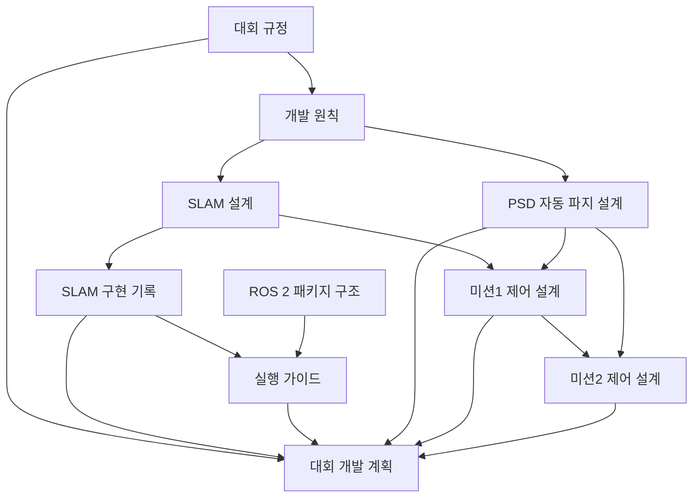

# CWU 로봇 프로젝트 목차

이 저장소의 문서와 구현 파일을 찾아가는 출발점입니다. Obsidian에서 `ros_CWU` 폴더를 보관함으로 열면 아래 내부 링크와 백링크로 문서 사이를 이동할 수 있습니다.

## 읽는 순서

| 문서 | 역할 | 다음 연결 |
|---|---|---|
| [[docs/competition_rules|대회 규정]] | 경기 요구사항과 금지 사항 정리 | 개발 원칙·미션 계획의 근거 |
| [[Agent|개발 원칙]] | 하드웨어 제약과 개발·검증 기준 | 설계 및 구현 시 적용 |
| [[docs/superpowers/specs/2026-09-08-slam-design|SLAM 설계]] | 센서·오도메트리·TF 인터페이스 | SLAM 구현 기록으로 연결 |
| [[docs/superpowers/plans/2026-09-08-slam|SLAM 구현 기록]] | 초기 작업 계획과 2026-09-09 검증 기록 | 실행 가이드로 재현 |
| [[README|실행 가이드]] | 환경 설정, 빌드, 데모, 실물 연결, 웹 UI, 테스트 | 현재 작업을 시작하는 문서 |
| [[docs/ros2_package_guide|ROS 2 패키지 구조]] | 패키지 필수 파일과 역할 (Python·C++) | 새 패키지를 만들 때 |
| [[docs/superpowers/plans/2026-09-10-competition-plan|대회 개발 계획]] | 베이스·주행·인지·파지·미션의 후속 단계 | 미확정 하드웨어부터 확인 |
| [[docs/superpowers/specs/2026-09-16-mission1-control-design|미션1 제어 설계]] | 제어 계층, Nav2 연동, D415 연결, 상태 전이 | Nav2·카메라 설치 후 검증 |
| [[docs/superpowers/specs/2026-09-16-mission2-control-design|미션2 제어 설계]] | 센서 역할, 확보·유지·재확보, 코너 회피, 상태 전이 | 설계 초안·미션2 구현 전 |
| [[docs/superpowers/specs/2026-09-16-psd-gripper-design|PSD 자동 파지 설계]] | 그리퍼 PSD 거리 감지 → 정지·자동 파지 → 유지 | 센서·감지 거리·구동기 확정 후 구현 |

> [!note] 문서의 기준
> 대회 규정 문서는 규정(안)의 요약이며 해석은 주최 측 원본이 우선입니다. 과거 계획의 체크박스·테스트 결과·Git 상태는 당시 기록입니다. 현재 구현과 실물 상태는 실행 가이드를 확인하고 필요한 검증을 다시 수행합니다.

## 관계도

## 구현 파일 지도

아래 경로는 저장소 루트 기준입니다. 코드는 편집기에서 열고, 사용법과 설계 근거는 연결된 문서에서 확인합니다.

| 파일·폴더 | 역할 | 관련 문서 |
|---|---|---|
| `src/cwu_slam/launch/`, `src/cwu_slam/cwu_slam/bringup.py` | 실물·데모 실행과 공통 구성 | [[README]], [[docs/superpowers/specs/2026-09-08-slam-design|SLAM 설계]] |
| `src/cwu_slam/config/` | SLAM·G4·센서 장착·데모 파라미터 | [[README|실물 연결과 보정 안내]] |
| `src/cwu_slam/cwu_slam/demo_sensors.py`, `geometry.py` | 가상 센서와 레이 교차 계산 | [[docs/superpowers/plans/2026-09-08-slam|SLAM 구현 기록]] |
| `src/cwu_slam/test/` | 수치·ROS 통합·G4 하드웨어 검증 | [[README|테스트 실행 안내]] |
| `src/cwu_slam/web/index.html`, `launch/web.launch.py` | 브라우저 모니터링 UI와 rosbridge 실행 | [[README|웹 UI 사용법]] |
| `src/cwu_slam/cwu_slam/mounts.py` | LiDAR·카메라 장착 TF 공용 로더 (`mount.yaml`) | [[README|장착값 보정]] |
| `src/cwu_base/` | 엔코더 틱 → `/odom`과 `odom → base_link` TF | [[README|엔코더 설정값 채우기]] |
| `src/cwu_nav/` | Nav2 주행 설정·런치, 목표물 정렬 시각 서보, 전체 스택 `autonomy.launch.py` | [[docs/superpowers/specs/2026-09-16-mission1-control-design|미션1 제어 설계]] |
| `src/cwu_perception/` | D415 드라이버 설정과 빨간 목표물 방향 검출 → `/target/bearing` (깊이 미사용) | [[docs/superpowers/specs/2026-09-16-mission1-control-design|미션1 제어 설계]] |
| `tools/` | 파이 시계 설정과 엔코더 시리얼 탐색 | [[README|환경 및 엔코더 준비]] |
| `dependencies.repos`, `colcon.meta`, `patches/` | 제조사 의존성과 빌드 재현 | [[README|빌드 안내]] |
| `build/`, `install/`, `log/` | 빌드·설치·실행 결과물 | [[README|새 환경에서 다시 빌드]] |

## 다음 작업을 찾는 법

- **실물 지도가 나오지 않을 때:** [[README|실행 가이드]]의 `odom → base_link` TF 조건과 엔코더 연결을 확인합니다. `src/cwu_base/config/encoder.yaml`의 실측값이 채워져 있어야 합니다.
- **로봇이 무엇을 보고 있는지 확인할 때:** [[README|웹 UI]]를 띄워 브라우저로 지도와 위치를 봅니다. RViz는 선택입니다.
- **새 패키지를 만들 때:** [[docs/ros2_package_guide|ROS 2 패키지 구조]]에서 필수 파일과 흔한 실수를 확인합니다.
- **다음 기능을 개발할 때:** [[docs/superpowers/plans/2026-09-10-competition-plan|대회 개발 계획]]에서 단계별 선행 조건을 확인합니다.
- **주행이나 목표물 인식을 건드릴 때:** [[docs/superpowers/specs/2026-09-16-mission1-control-design|미션1 제어 설계]]에서 계층 구분과 인터페이스 상태표를 먼저 확인합니다. `/cmd_vel`을 받는 모터 노드가 아직 없어 실물은 움직이지 않습니다.
- **PSD·그리퍼를 연결할 때:** [[docs/superpowers/specs/2026-09-16-psd-gripper-design|PSD 자동 파지 설계]]에서 미확정 사양과 파지 활성화·거리 감지·정지·유지 판정 조건을 확인합니다. 제어 코드는 아직 미구현입니다.
- **미션 동작을 결정할 때:** [[docs/competition_rules|대회 규정]]에서 해당 미션의 판정 기준을 먼저 확인합니다.
- **SLAM을 재검증할 때:** [[README|실행 가이드]]의 테스트 명령을 사용합니다. [[docs/superpowers/plans/2026-09-08-slam|이전 검증 기록]]은 비교 자료입니다.
